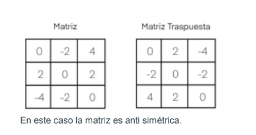
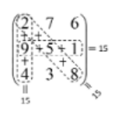
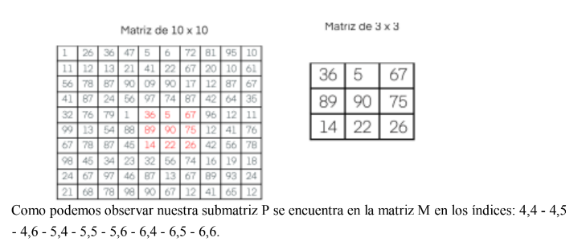
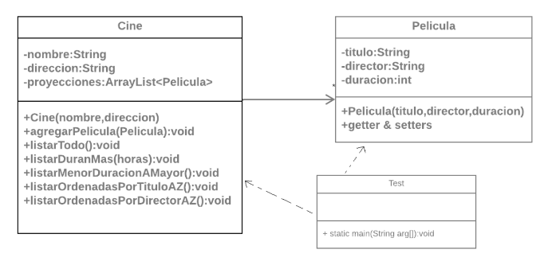

# **Guía 5**

## **Ejercicios realizado durante los encuentros 43 al 49**

- ### **Ejercicio 1**

     En un nuevo proyecto, crear una clase de nombre Arreglo con los siguientes métodos estáticos (static):
  - **sumarLista** Método que reciba por parámetro un arreglo unidimensional de enteros y muestre por pantalla la suma y promedio de los mismos.

  - **buscarMayor** Método que reciba por parámetro un arreglo bidimensional e irregular de enteros y retorne el entero más grande que se encuentra en el arreglo.
  
  - **cuentaVocales** Método que reciba por parámetro un String y retorne la cantidad de vocales que tiene la cadena.

  - **cuentaCaracter** Método que reciba por parámetro un String y un carácter, luego retorne la cantidad de veces que se repite en la cadena el carácter recibido.

- ### **Ejercicio 2**

     En un nuevo proyecto en el método main de su clase principal, se pide crear un algoritmo que rellene un vector con los 100 primeros números enteros y los muestre por pantalla en orden descendente.

- ### **Ejercicio 3**

     En un nuevo proyecto, en el método main de su clase principal, se pide crear un algoritmo que rellene un vector de tamaño N con valores aleatorios y le pida al usuario un número a buscar en el vector. El programa mostrará donde se encuentra el número y si se encuentra repetido
  
- ### **Ejercicio 4**

    En un nuevo proyecto, en el método main de su clase principal, se pide realizar un algoritmo que rellene un matriz de 4 x 4 de valores aleatorios y muestre la traspuesta de la matriz.
  
- ### **Ejercicio 5**

     En un nuevo proyecto, en el método main de su clase principal, se pide realice un algoritmo que compruebe si una matriz dada es anti simétrica. Se dice que una matriz **A** es anti simétrica cuando ésta es igual a su propia traspuesta, pero cambiada de signo. Es decir, **A** es anti simétrica si **A = -AT**.
     La matriz traspuesta de una matriz **A** se denota por **AT** y se obtiene cambiando sus filas por columnas (o viceversa).

     

- ### **Ejercicio 6**

     Un cuadrado mágico 3 x 3 es una matriz 3 x 3 formada por números del 1 al 9 donde la suma de sus filas, sus columnas y sus diagonales son idénticas. Crear un programa que permita introducir un cuadrado por teclado y determine si este cuadrado es mágico o no. El programa deberá comprobar que los números introducidos son correctos, es decir, están entre el 1 y el 9.

     

     Modele e implemente las clases Java con los métodos necesarios para poder resolver este problema. Luego realice las pruebas necesarias desde el método main de la clase principal del proyecto.

- ### **Ejercicio 7**

     Dadas dos matrices cuadradas de números enteros, la matriz M de 10x10 y la matriz P de 3x3, se solicita escribir un programa en el cual se compruebe si la matriz P está contenida dentro de la matriz M. Para ello se debe verificar si entre todas las submatrices de 3x3 que se pueden formar en la matriz M, desplazándose por filas o columnas, existe al menos una que coincida con la matriz P. En ese caso, el programa debe indicar la fila y la columna de la matriz M en la cual empieza el primer elemento de la submatriz P.
     
     
     
     Modele e implemente las clases Java con los métodos necesarios para poder resolver este problema. Luego realice las pruebas necesarias desde el método main de la clase principal del proyecto.

## **Ejercicios realizado durante los encuentros 50 al 56**

- ### **Ejercicio 8**

    Dado el siguiente modelo, implementar según la consigna.

     

  ### Descripción de los métodos de la clase Cine

  - **agregarPelicula(Pelicula):void** Recibe una Película y la agrega a la lista que posee el Cine.
  - **listarTodo():void** Muestra por consola todas las Películas registradas en el Cine.
  - **listarDuranMas(horas):void** Reciba una cantidad de horas y muestra por consola todas las películas que tengan una duración mayor a la recibida por parámetro.
  - **listarMenorDuracionAMayorDuracion():void** Lista las Películas ordenadas de menor a mayor.
  - **listarOrdenadasPorTituloAZ():void** Lista las Películas ordenadas alfabéticamente por el título.
  - **listarOrdenadasPorDirectorAZ():void** Lista las Películas ordenadas alfabéticamente por el director
  
  ### Desde el método main de una clase Test, se pide
  - Crear el Cine ROMA SRL, ubicado en Rivadavia 325.
  - Definir un bucle que crea un objeto Película pidiéndole al usuario todos sus datos y guardándolos en el objeto Película. Después, esa Película se guarda en el Cine usado su método agregarPelicula y se le pregunta al usuario si quiere crear otra Película o no.
  - Pedir al Cine que liste las películas que duren más de x cantidad de horas que el usuario ingresará por teclado.
  - Pedir al cine que liste todas las películas.
  - Pedir al cine que liste las películas ordenadas por título.
  - Pedir al cine que liste las películas ordenadas por director.
   - Pedir al cine que liste las películas ordenadas por duración.

- ### **Ejercicio 9**

     Basados en el ejemplo anterior, ahora nos piden que las Películas no deben repetirse en el Cine, para ello en lugar de utilizar un ArrayList, utilizaremos un HashSet; pero ojo!!! Para que el HashSet sepa cuando una Película está repetida, es decir, tienen el mismo título, bastará con sobreescribir los métodos equals y hashCode en la clase Película.
